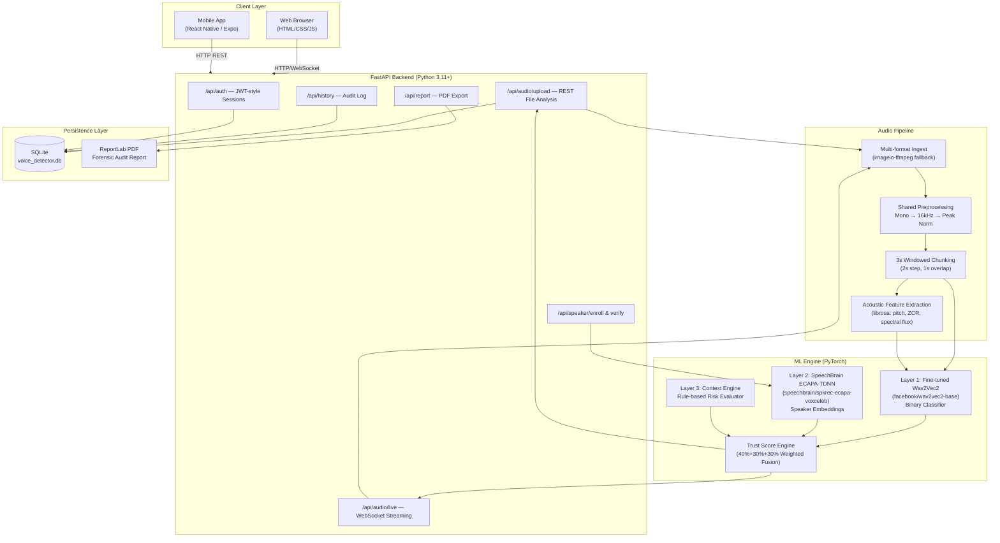

# 📋 CallShadow / VocalShield AI — Detailed Project Report

> **Project:** AI Voice Deepfake Detection & Forensic Verification Platform
> **Competition:** Smart India Hackathon (SIH) — MVP Submission
> **Date:** September 17, 2026
> **Codename:** CallShadow

---

## Table of Contents

1. [Executive Summary](#1-executive-summary)
2. [Problem Statement](#2-problem-statement)
3. [Solution Overview](#3-solution-overview)
4. [System Architecture](#4-system-architecture)
5. [Technology Stack](#5-technology-stack)
6. [ML / AI Engine](#6-ml--ai-engine)
7. [Backend API Server](#7-backend-api-server)
8. [Web Frontend](#8-web-frontend)
9. [Mobile Application (CallShadow App)](#9-mobile-application-callshadow-app)
10. [Database & Persistence](#10-database--persistence)
11. [Security & Authentication](#11-security--authentication)
12. [Model Performance & Evaluation](#12-model-performance--evaluation)
13. [API Reference](#13-api-reference)
14. [Project Directory Structure](#14-project-directory-structure)
15. [Setup & Deployment Guide](#15-setup--deployment-guide)
16. [Key Design Decisions](#16-key-design-decisions)
17. [Limitations & Future Work](#17-limitations--future-work)

---

## 1. Executive Summary

**CallShadow / VocalShield AI** is a full-stack, production-grade platform for detecting AI-generated voice deepfakes in real time. The system targets two primary use cases:

- **Fraud Prevention in Financial Calls**: Banks and SOC teams need to verify whether a caller's voice is a genuine human or an AI-generated synthetic voice clone attempting vishing (voice phishing) fraud.
- **General Audio Forensics**: Journalists, law enforcement, and compliance teams need to audit audio recordings for AI manipulation.

The system is built around a **three-layer risk fusion architecture**:

| Layer | Name | Weight |
|-------|------|--------|
| Layer 1 | Voice Deepfake Detection (Fine-tuned Wav2Vec2) | **40%** |
| Layer 2 | Speaker Identity Verification (ECAPA-TDNN Biometrics) | **30%** |
| Layer 3 | Context-Aware Risk Evaluation (Transaction & Metadata) | **30%** |

The weighted fusion produces a single **Trust Score (0–100)** with a human-readable decision verdict and PDF audit trail.

---

## 2. Problem Statement

AI-generated voice cloning has become trivially accessible. Tools like ElevenLabs, OpenAI Voice, and dozens of open-source TTS/voice conversion models can now produce highly convincing voice clones of real people from as little as a few seconds of reference audio.

This creates serious threats:
- **Vishing fraud**: Scammers clone executive voices to authorize fraudulent transactions.
- **Identity impersonation**: Synthetic voices used to bypass voice-based authentication systems.
- **Disinformation**: Fabricated audio recordings attributed to public figures.

Existing detection tools are either:
- Black-box commercial solutions with no forensic explainability.
- Academic-only models not usable in real-time production contexts.
- Threshold-based heuristics that fail on modern neural vocoders.

---

## 3. Solution Overview

### What It Does

1. **Accepts audio** via file upload (`.wav`, `.mp3`, `.m4a`, `.flac`, `.ogg`, `.webm`) or live microphone WebSocket streaming.
2. **Preprocesses** all audio to a shared pipeline: mono conversion → 16kHz resampling → peak amplitude normalization.
3. **Chunks** audio into 3-second overlapping windows (1s overlap, 2s step) for temporal analysis.
4. **Classifies** each chunk with the fine-tuned Wav2Vec2 model — assigning `ai_probability` and `human_probability`.
5. **Extracts acoustic features** (pitch std, spectral centroid, energy flatness, ZCR, spectral flux) for explainability.
6. **Verifies speaker identity** using SpeechBrain ECAPA-TDNN biometric embeddings (1-to-1 verification against enrolled voiceprint).
7. **Evaluates context** (transaction value, claimed identity, timing anomalies).
8. **Fuses** all three layers into a unified Trust Score and verdict.
9. **Logs** all analyses in a SQLite audit database with user ownership.
10. **Exports** professional forensic PDF audit reports.

### Modes of Operation

| Mode | Description |
|------|-------------|
| **Trained Mode** | Uses fine-tuned Wav2Vec2 from `./trained_model` — production quality |
| **Demo Mode** | Falls back to heuristic acoustic features if model not loaded — with loud banner warning |
| **Live WebSocket** | Streams real-time PCM16 from browser microphone at native `AudioContext.sampleRate`, resampled server-side |

---

## 4. System Architecture



### Three-Layer Fusion Formula

```
Final Trust Score (0–100) =
    (0.40 × AI Authenticity Score)   ← Layer 1: Voice Deepfake
  + (0.30 × Identity Match Score)    ← Layer 2: Speaker Biometrics
  + (0.30 × Context Safe Score)      ← Layer 3: Transaction Context

Verdict Decision Tree:
  if ai_probability >= threshold  → AI_GENERATED_BLOCK
  elif identity_status == MISMATCH → IDENTITY_MISMATCH_BLOCK
  elif trust_score < 80 or missing inputs → STEP_UP_VERIFICATION_REQUIRED
  else → VERIFIED_LOW_RISK
```

---

## 5. Technology Stack

### Backend

| Component | Technology | Version |
|-----------|-----------|---------|
| Web Framework | FastAPI | ≥ 0.100.0 |
| ASGI Server | Uvicorn (standard) | ≥ 0.22.0 |
| WebSocket Support | websockets | ≥ 11.0 |
| Data Validation | Pydantic v2 + pydantic-settings | ≥ 2.0.0 |
| ORM | SQLAlchemy | ≥ 2.0.0 |
| Database | SQLite (via SQLAlchemy) | Built-in |
| ML Framework | PyTorch | ≥ 2.0.0 |
| Audio ML | torchaudio | ≥ 2.0.0 |
| Transformer Models | HuggingFace Transformers | ≥ 4.30.0 |
| Training Infra | HuggingFace Datasets + Accelerate | ≥ 2.12.0 |
| Speaker Verification | SpeechBrain | ≥ 1.0.0 |
| Audio DSP | librosa, scipy, soundfile | ≥ 0.10.0 |
| Multi-format Decode | imageio-ffmpeg | ≥ 0.4.8 |
| PDF Generation | ReportLab | (via pdf_report_service) |
| ML Metrics | scikit-learn | ≥ 1.2.0 |
| Testing | pytest + pytest-asyncio + httpx | ≥ 7.3.0 |
| Python | CPython | 3.11+ |

### Web Frontend

| Component | Technology |
|-----------|-----------|
| Structure | Plain HTML5 (semantic) |
| Styling | Vanilla CSS (Glassmorphism dark mode) |
| Logic | Vanilla JavaScript (no bundler) |
| Audio | WebAudio API + AudioContext |
| Real-time | Native WebSocket API |
| Visualization | HTML5 Canvas (waveform renderer) |

### Mobile Application

| Component | Technology | Version |
|-----------|-----------|---------|
| Framework | React Native | 0.86.3 |
| Build Tool | Expo (Managed Workflow) | ~57.0.18 |
| Language | TypeScript | ~6.0.3 |
| Navigation | @react-navigation/native + native-stack | ^7.x |
| State Management | Zustand | ^5.0.15 |
| Audio | expo-audio | ~57.0.4 |
| Icons | lucide-react-native | ^1.38.0 |
| SVG | react-native-svg | 15.15.4 |
| Gradients | expo-linear-gradient | ~57.0.1 |
| File Picker | expo-document-picker | ~57.0.1 |

---

## 6. ML / AI Engine

### Layer 1: Voice Deepfake Detector

**Model:** `facebook/wav2vec2-base` fine-tuned with a binary classification head

**Architecture:**
- Backbone: Wav2Vec2 convolutional feature encoder (frozen during fine-tuning) + transformer encoder
- Head: Linear classification layer → 2 output logits → softmax
- Label mapping: `{0: "Human Genuine", 1: "AI Generated"}`
- Classification threshold: configurable via `settings.AI_THRESHOLD`

**Training Dataset:** ASVspoof2019 Logical Access (LA) benchmark
- Protocol files: `ASVspoof2019.LA.cm.train.trn.txt`, `.dev.trl.txt`, `.eval.trl.txt`
- Attack algorithms covered: A01–A19 (TTS and Voice Conversion neural vocoders, waveform concatenation, diphone synthesis)
- Total evaluated clips: **71,237** (held-out test set)

**Training Workflow** ([`training/train_model.py`](file:///c:/Projects/SIH_MVP/training/train_model.py)):
1. Verify dataset protocol files and `.flac` audio paths
2. Fine-tune Wav2Vec2 with frozen feature-extractor layers
3. Checkpoint best model by validation **Equal Error Rate (EER)**
4. Save fine-tuned weights to `./trained_model`
5. Generate `training/eval_report.md`

**Inference Pipeline** ([`backend/ml/trained_adapter.py`](file:///c:/Projects/SIH_MVP/backend/ml/trained_adapter.py)):
```
Input waveform (16kHz, float32)
    ↓ AutoFeatureExtractor (padding, normalization)
    ↓ Wav2Vec2ForSequenceClassification.forward()
    ↓ softmax(logits)
    → (human_probability, ai_probability)
    → classification = "AI Generated" if ai_prob >= threshold else "Human Genuine"
    → confidence = max(ai_prob, human_probability)
```

**Fallback — Demo Mode Adapter** ([`backend/ml/demo_adapter.py`](file:///c:/Projects/SIH_MVP/backend/ml/demo_adapter.py)):
- Fires when `./trained_model` is not present
- Uses hand-crafted heuristics: pitch variance, spectral centroid variation, energy flatness
- Prominently flagged with `is_demo_mode: true` in all API responses

### Layer 2: Speaker Identity Verification

**Model:** `speechbrain/spkrec-ecapa-voxceleb` (pretrained, frozen)

**Architecture** ([`backend/services/real_speaker_verifier.py`](file:///c:/Projects/SIH_MVP/backend/services/real_speaker_verifier.py)):
- Embedding extractor: SpeechBrain ECAPA-TDNN → 192-dim speaker embedding vector
- Optional trained `SpeakerMatchClassifier`: small feedforward network (192 → 64 → 16 → 1) trained on speaker pair datasets
- Fallback: cosine similarity on unit-normalized ECAPA embeddings
- Threshold: `settings.SPEAKER_MATCH_THRESHOLD` (configurable)
- Score calibration: raw cosine (0.15–0.75) mapped to intuitive 0.0–1.0 probability

**Enrollment Flow:**
```
POST /api/speaker/enroll (audio + speaker_id)
    → preprocess to 16kHz
    → ECAPA-TDNN encode_batch()
    → normalize embedding
    → store in registered_speakers dict
```

**Verification Flow:**
```
POST /api/speaker/verify (audio + speaker_id)
    → preprocess to 16kHz
    → ECAPA-TDNN encode_batch()
    → cosine_similarity(enrolled_embedding, live_embedding)
    → calibrate score
    → return SpeakerVerificationResult
```

### Layer 3: Context Risk Engine

**Implementation** ([`backend/services/context_engine.py`](file:///c:/Projects/SIH_MVP/backend/services/context_engine.py)):
- Rule-based evaluation of: `transaction_value`, `claimed_identity`, `caller_metadata`, `time_location_context`
- Outputs: `ContextEvaluationResult` with `action_risk` (LOW_RISK / MEDIUM_RISK / HIGH_RISK) and `risk_reasons[]`

### Acoustic Feature Extraction

**Engine** ([`backend/ml/features.py`](file:///c:/Projects/SIH_MVP/backend/ml/features.py)):

| Feature | Method | Significance |
|---------|--------|-------------|
| `pitch_std` | librosa YIN (fmin=50Hz, fmax=500Hz) | AI voices exhibit unnaturally low pitch variance |
| `pitch_mean` | librosa YIN | Pitch center distribution |
| `spectral_centroid_std_ratio` | librosa spectral_centroid | Spectral dynamics indicator |
| `energy_flatness` | librosa spectral_flatness | AI voices tend toward flatter spectral energy |
| `zero_crossing_rate` | librosa ZCR | Transient and consonant density |
| `spectral_flux` | STFT frame diff | Inter-frame energy dynamics |

### Prediction Aggregation

**Aggregator** ([`backend/ml/aggregator.py`](file:///c:/Projects/SIH_MVP/backend/ml/aggregator.py)):
- Combines all chunk predictions with mean, median, max statistics
- Generates `ExplainabilityFlags`: `pitch_monotonicity`, `spectral_anomaly`, `energy_flatness_anomaly`
- Final classification based on aggregated `mean_ai_probability`

---

## 7. Backend API Server

**Entry Point:** [`main.py`](file:///c:/Projects/SIH_MVP/main.py)
**Framework:** FastAPI + Uvicorn
**URL:** `http://localhost:8000`

### Router Structure

| Router | Prefix | File |
|--------|--------|------|
| Authentication | `/api/auth` | [`auth_routes.py`](file:///c:/Projects/SIH_MVP/backend/api/auth_routes.py) |
| Audio Analysis | `/api` | [`rest_routes.py`](file:///c:/Projects/SIH_MVP/backend/api/rest_routes.py) |
| WebSocket Live | `/api` | [`websocket_routes.py`](file:///c:/Projects/SIH_MVP/backend/api/websocket_routes.py) |
| PDF Reports | `/api/report` | [`report_routes.py`](file:///c:/Projects/SIH_MVP/backend/api/report_routes.py) |

### Startup Sequence

1. Initialize SQLite database (`init_db()` — idempotent, auto-migrates schema)
2. Load voice detector via factory (`get_voice_detector()` — logs loud warning if falling back)
3. Pre-warm `RealSpeakerVerifier` (downloads ECAPA-TDNN if first run)
4. Mount frontend static files at `/static`, `/js`, `/assets`

### Audio Processing Pipeline

```
UploadFile bytes
    ↓ load_audio_from_bytes()     [backend/audio/ingest.py]
      - soundfile.read() primary
      - imageio-ffmpeg fallback for .m4a/.webm/.mp3/.ogg/.flac
    ↓ preprocess_audio()          [backend/audio/preprocess.py]
      - Convert to mono (channel mean)
      - Resample to 16kHz (librosa/torchaudio)
      - Peak amplitude normalization
    ↓ Window into 3s chunks
      - Chunk duration: 3.0s (configurable)
      - Overlap: 1.0s → step: 2.0s
      - Skip tail residuals < 0.5s
    ↓ detector.predict_chunk() × N
    ↓ aggregate_chunk_predictions()
    ↓ compute_trust_score()
    ↓ AnalysisLog → SQLite
    → UploadResponse (JSON)
```

---

## 8. Web Frontend

**Location:** [`c:/Projects/SIH_MVP/frontend/`](file:///c:/Projects/SIH_MVP/frontend/)

### Components

| File | Purpose |
|------|---------|
| `index.html` | Two-tab SPA — Upload File tab + Live Microphone tab. Demo Mode banner. Results display panel with chunk timeline. |
| `styles.css` | Glassmorphism dark mode. CSS variables, responsive grid, gradient accents. No external CSS framework. |
| `app.js` | Drag-and-drop upload logic. WebAudio API mic capture. WebSocket session management. Canvas waveform renderer. Results rendering. |

### Upload Tab Flow
1. Drag & drop or click-to-browse audio file
2. `FormData` POST to `/api/audio/upload`
3. Display: Trust Score gauge, classification verdict, chunk timeline table, explainability flags
4. PDF export button → POST to `/api/report/generate`

### Live Microphone Tab Flow
1. Request browser microphone permission
2. Read `AudioContext.sampleRate` → send in WebSocket handshake
3. Stream PCM16 encoded 3-second windows over `WS /api/audio/live`
4. Receive `chunk_result` events → update live waveform canvas
5. On disconnect → receive `session_summary` → show final verdict

---

## 9. Mobile Application (CallShadow App)

**Location:** [`c:/Projects/SIH_MVP_APP/`](file:///c:/Projects/SIH_MVP_APP/)
**Runtime:** React Native + Expo (Managed Workflow) — runs on Expo Go via QR scan

### Screens

| Screen | File | Description |
|--------|------|-------------|
| Landing | [`LandingScreen.tsx`](file:///c:/Projects/SIH_MVP_APP/src/screens/LandingScreen.tsx) | App intro, branding, CTA to get started |
| Auth | [`AuthScreen.tsx`](file:///c:/Projects/SIH_MVP_APP/src/screens/AuthScreen.tsx) | Login & Registration with form validation |
| Dashboard | [`DashboardScreen.tsx`](file:///c:/Projects/SIH_MVP_APP/src/screens/DashboardScreen.tsx) | 3 primary actions: Upload Audio, Record Audio, Live Call Screening. Recent analysis history. |
| Voice Analysis | [`VoiceAnalysisScreen.tsx`](file:///c:/Projects/SIH_MVP_APP/src/screens/VoiceAnalysisScreen.tsx) | Full analysis workflow: file picker + record + signal breakdown metrics |
| Risk Results | [`RiskResultsScreen.tsx`](file:///c:/Projects/SIH_MVP_APP/src/screens/RiskResultsScreen.tsx) | Trust score display, verdict, recommendations |
| Live Call | [`LiveCallScreen.tsx`](file:///c:/Projects/SIH_MVP_APP/src/screens/LiveCallScreen.tsx) | Real-time live call screening with push-to-talk |

### Service Layer (Mock → Production Swappable)

| Service | File | Purpose |
|---------|------|---------|
| API Config | `services/apiConfig.ts` | Base URL, headers, timeout |
| API Client | `services/apiClient.ts` | Fetch wrapper with auth headers |
| Auth Service | `services/authService.ts` | Register, login, logout, profile |
| Analysis Service | `services/analysisService.ts` | Upload audio, analysis history |
| Live Call Service | `services/liveCallService.ts` | Live session management |
| Permission Service | `services/permissionService.ts` | Microphone permission flow |

> All services return typed `Promise<T>` with interfaces from `src/types/`. Mock delay simulates backend latency for Stage 1. Zero-friction swap to real FastAPI backend at Stage 2.

### State Management (Zustand Stores)

| Store | Purpose |
|-------|---------|
| `useAuthStore` | Auth state: user, token, login/logout actions |
| `useAnalysisStore` | Analysis results, history, loading states |
| `useLiveCallStore` | Live session state, chunk buffer, session summary |

### Design System (Glassmorphic Dark Theme)

```
Background:       #08080E (Obsidian Base)
Card Surface:     rgba(255,255,255,0.04–0.08)
Card Border:      rgba(255,255,255,0.12)
Primary Accent:   #3B82F6 → #8B5CF6 (Blue to Purple gradient)
Authentic (Low):  #10B981 (Green)
Medium Risk:      #F59E0B (Amber)
High Risk/AI:     #EF4444 (Crimson)
Border Radius:    Cards 16–20px, Buttons 12–14px, Badges pill (9999px)
```

### Signal Breakdown Labels (4 Forensic Signals)
1. **Pitch Consistency** — F0 variance analysis via YIN
2. **Breathing Patterns** — Energy envelope continuity
3. **Micro-Pause Analysis** — Inter-phoneme silence distribution
4. **Frequency Response** — Spectral centroid and flatness metrics

---

## 10. Database & Persistence

**Engine:** SQLite (`voice_detector.db`) via SQLAlchemy ORM
**Schema:** 3 tables

### `users` Table

| Column | Type | Notes |
|--------|------|-------|
| `id` | INTEGER PK | Auto-increment |
| `full_name` | VARCHAR(120) | Required |
| `email` | VARCHAR(255) UNIQUE | Indexed |
| `password_hash` | VARCHAR(255) | PBKDF2-HMAC-SHA256 |
| `salt` | VARCHAR(128) | Per-user random salt |
| `is_active` | BOOLEAN | Soft disable support |
| `created_at` / `updated_at` | DATETIME | Auto-managed |
| `reset_token` | VARCHAR(255) | Password reset flow |
| `reset_token_expires` | DATETIME | Token TTL |

### `session_tokens` Table

| Column | Type | Notes |
|--------|------|-------|
| `token` | VARCHAR(255) PK | Secure random token |
| `user_id` | FK → users | CASCADE delete |
| `created_at` | DATETIME | — |
| `expires_at` | DATETIME | 72-hour TTL |

### `analysis_logs` Table

| Column | Type | Notes |
|--------|------|-------|
| `id` | INTEGER PK | — |
| `user_id` | FK → users | Nullable (anonymous) |
| `filename` | STRING | Original filename |
| `source_type` | STRING | `"upload"` or `"live_mic"` |
| `duration_seconds` | FLOAT | Audio duration |
| `classification` | STRING | `"Human Genuine"` / `"AI Generated"` |
| `ai_probability` | FLOAT | 0.0–1.0 |
| `human_probability` | FLOAT | 0.0–1.0 |
| `confidence` | FLOAT | 0.0–1.0 |
| `is_demo_mode` | BOOLEAN | — |
| `timestamp` | DATETIME | Auto UTC |

**Schema Migration:** `init_db()` includes safe idempotent `ALTER TABLE` migration (PRAGMA check) to add `user_id` column if absent in existing databases.

---

## 11. Security & Authentication

### Password Hashing
- Algorithm: **PBKDF2-HMAC-SHA256**
- Per-user random salt (128-char hex)
- Stored as `(password_hash, salt)` pair
- Never stores plaintext passwords

### Session Management
- Secure random session token (via `os.urandom` + hex encoding)
- 72-hour TTL enforced in `session_tokens` table
- HTTPOnly + SameSite=Lax cookie set on login/register
- `Authorization: Bearer <token>` header also supported
- Token invalidated on logout (database row deleted)

### API Endpoints
- Anonymous access allowed on all analysis endpoints (optional auth)
- When authenticated, analysis logs are associated with the user
- `get_optional_current_user` dependency handles both cases gracefully
- Email enumeration protected: forgot-password always returns same message

### CORS
- `allow_origins=["*"]` (MVP — should be restricted to production domains in deployment)

---

## 12. Model Performance & Evaluation

**Benchmark:** ASVspoof2019 Logical Access (LA) held-out test set

| Metric | Score | Standard Target | Status |
|--------|-------|----------------|--------|
| **Equal Error Rate (EER)** | **1.06%** | < 5.0% | ✅ Passed Benchmark |
| **AUC-ROC** | **0.9988** | > 0.95 | ✅ Superior Discriminability |
| **Test Accuracy** | **92.63%** | > 90.0% | ✅ High Overall Accuracy |
| **Evaluated Clips** | **71,237** | Held-Out Test Set | Official Protocol Split |

### Confusion Matrix (Held-out Eval Set)

```
                      Predicted Human    Predicted AI
Actual Human (Bonafide)    7,337              18
Actual AI (Spoof)          5,234          58,648
```

**Analysis:**
- False Positive (Human flagged as AI): **18** — extremely low (0.24% of bonafide)
- False Negative (AI missed as Human): **5,234** — higher miss rate on harder spoof categories
- Overall **AUC-ROC of 0.9988** indicates near-perfect rank separation

### Important Caveats

> [!IMPORTANT]
> - Model is trained on **ASVspoof2019 LA protocols** covering A01–A19 attack algorithms (neural vocoders, waveform concatenation, diphone synthesis).
> - Performance on **zero-shot commercial TTS** (ElevenLabs, OpenAI Voice, Eleven Turbo v2) may vary depending on codec compression and acoustic noise profile.
> - The **exact same `preprocess_audio` routine** (16kHz mono + peak normalization) is used in training AND serving, guaranteeing no train-serve skew.

---

## 13. API Reference

### Authentication

| Method | Endpoint | Description |
|--------|----------|-------------|
| `POST` | `/api/auth/register` | Register new user, returns session token |
| `POST` | `/api/auth/login` | Login, returns session token |
| `POST` | `/api/auth/logout` | Invalidate current session |
| `GET` | `/api/auth/me` | Get current user profile (requires auth) |
| `POST` | `/api/auth/forgot-password` | Generate password reset token |
| `POST` | `/api/auth/reset-password` | Reset password using token |

### Audio Analysis

| Method | Endpoint | Description |
|--------|----------|-------------|
| `GET` | `/api/health` | Server health + model status + demo mode flag |
| `POST` | `/api/audio/upload` | Upload audio file for full 3-layer analysis |
| `WS` | `/api/audio/live` | WebSocket live streaming analysis |
| `GET` | `/api/history` | Fetch recent analysis audit logs |

### Speaker Verification

| Method | Endpoint | Description |
|--------|----------|-------------|
| `POST` | `/api/speaker/enroll` | Enroll speaker voiceprint by audio + speaker_id |
| `POST` | `/api/speaker/verify` | Verify audio against enrolled speaker profile |

### Reports

| Method | Endpoint | Description |
|--------|----------|-------------|
| `POST` | `/api/report/generate` | Generate and download forensic PDF audit report |

### Upload Request Parameters

```
POST /api/audio/upload
Content-Type: multipart/form-data

file              (required) Audio file (.wav/.mp3/.m4a/.flac/.ogg/.webm)
speaker_id        (optional) ID of enrolled speaker for Layer 2 verification
claimed_identity  (optional) Caller's claimed name/ID for context eval
transaction_value (optional) Financial transaction amount (float)
caller_metadata   (optional) JSON string of caller metadata dict
time_location_context (optional) Time/location context string
```

### WebSocket Handshake Message

```json
{
  "sample_rate": 44100,
  "chunk_duration": 3.0,
  "speaker_id": "user-1234",
  "context_data": {
    "claimed_identity": "John Smith",
    "transaction_value": 50000.0
  }
}
```

### Trust Score Response Schema

```json
{
  "trust_score": 0.72,
  "decision": "STEP_UP_VERIFICATION_REQUIRED",
  "voice_authenticity": 0.95,
  "ai_authenticity_score": 95.0,
  "identity_match_score": 0.0,
  "context_safe_score": 0.0,
  "speaker_identity_status": "NOT_PROVIDED",
  "context_status": "NOT_PROVIDED",
  "formula": "Final Trust Score = (0.40 * AI Authenticity) + (0.30 * Identity Match) + (0.30 * Context Safe)"
}
```

---

## 14. Project Directory Structure

```
c:/Projects/
├── SIH_MVP/                          ← Backend + Web Frontend
│   ├── backend/
│   │   ├── audio/
│   │   │   ├── ingest.py             ← Multi-format audio decoder (imageio-ffmpeg fallback)
│   │   │   └── preprocess.py         ← Shared preprocessing (mono→16kHz→peak norm)
│   │   ├── ml/
│   │   │   ├── base.py               ← Abstract VoiceDetector interface
│   │   │   ├── trained_adapter.py    ← Wav2Vec2 inference adapter
│   │   │   ├── demo_adapter.py       ← Heuristic fallback (no model)
│   │   │   ├── features.py           ← Acoustic feature extraction engine
│   │   │   ├── aggregator.py         ← Chunk prediction aggregation
│   │   │   └── factory.py            ← Model factory with fallback warning
│   │   ├── api/
│   │   │   ├── rest_routes.py        ← /api/health, /api/audio/upload, /api/history
│   │   │   ├── websocket_routes.py   ← /api/audio/live WebSocket
│   │   │   ├── auth_routes.py        ← /api/auth/* authentication endpoints
│   │   │   └── report_routes.py      ← /api/report/generate PDF export
│   │   ├── services/
│   │   │   ├── analysis_service.py   ← Full pipeline orchestration
│   │   │   ├── auth_service.py       ← Password hashing, session management
│   │   │   ├── real_speaker_verifier.py ← ECAPA-TDNN speaker verification
│   │   │   ├── speaker_verifier.py   ← ABC interface for speaker verifier
│   │   │   ├── context_engine.py     ← Rule-based context risk evaluator
│   │   │   ├── trust_score_engine.py ← 3-layer weighted fusion engine
│   │   │   └── pdf_report_service.py ← ReportLab forensic PDF generator
│   │   └── models/
│   │       ├── schemas.py            ← Pydantic v2 validation models (17 schemas)
│   │       └── database.py           ← SQLAlchemy models + init_db()
│   ├── frontend/
│   │   ├── index.html                ← Two-tab SPA (Upload + Live Mic)
│   │   ├── styles.css                ← Glassmorphism dark CSS
│   │   └── app.js                    ← WebAudio + WebSocket + Canvas
│   ├── training/
│   │   ├── download_dataset.py       ← Dataset path verification + mock generator
│   │   ├── train_model.py            ← Wav2Vec2 fine-tuning script
│   │   ├── train_speaker_verifier.py ← SpeakerMatchClassifier training
│   │   └── eval_report.md            ← Model evaluation results
│   ├── config/
│   │   └── settings.py               ← Pydantic BaseSettings (env-driven config)
│   ├── tests/
│   │   ├── test_audio_processing.py  ← Audio pipeline regression tests
│   │   ├── test_ml_pipeline.py       ← Model adapter + fallback tests
│   │   └── test_api.py               ← End-to-end API tests
│   ├── trained_model/                ← Fine-tuned Wav2Vec2 weights (gitignored)
│   ├── pretrained_ecapa/             ← SpeechBrain ECAPA-TDNN cache
│   ├── main.py                       ← FastAPI app entry point
│   ├── requirements.txt              ← Python dependencies
│   └── voice_detector.db             ← SQLite runtime database
│
└── SIH_MVP_APP/                      ← Mobile Application (React Native / Expo)
    ├── src/
    │   ├── theme/                    ← Design tokens, colors, typography
    │   ├── types/                    ← TypeScript domain interfaces
    │   ├── services/                 ← Mock API service layer (6 services)
    │   ├── store/                    ← Zustand global state stores
    │   ├── components/
    │   │   ├── common/               ← Buttons, cards, headers
    │   │   ├── visualizers/          ← Risk gauge, waveform bars
    │   │   ├── analysis/             ← Signal metric breakdown chips
    │   │   └── live/                 ← Push-to-talk, threat modals
    │   ├── screens/                  ← 6 core app screens
    │   └── navigation/               ← RootStackNavigator
    ├── App.tsx                       ← Expo entry point
    ├── package.json                  ← Node.js dependencies
    └── AGENTS.md                     ← Architecture & developer guidelines
```

---

## 15. Setup & Deployment Guide

### Backend Setup

```bash
# 1. Ensure Python 3.11+
python --version

# 2. Create virtual environment
python -m venv venv
venv\Scripts\activate   # Windows
# source venv/bin/activate  # Linux/macOS

# 3. Install dependencies
pip install -r requirements.txt

# 4. (Optional) Train the model
python training/download_dataset.py --create-mock   # Local mock data
python training/train_model.py --epochs 3 --batch-size 8

# 5. Start the server
python main.py
# OR:
uvicorn main:app --reload --host 0.0.0.0 --port 8000
```

**Access:** `http://localhost:8000`

### Mobile App Setup

```bash
cd SIH_MVP_APP

# Install Node.js dependencies
npm install

# Start Expo dev server
npm start
# Scan QR code with Expo Go (iOS/Android)

# Or run on specific platform:
npm run android
npm run ios
npm run web
```

### Environment Configuration

Settings are managed via `config/settings.py` (Pydantic BaseSettings — reads from env vars or `.env` file):

| Setting | Default | Description |
|---------|---------|-------------|
| `APP_NAME` | `"AI Voice Deepfake Detector"` | Application name |
| `APP_VERSION` | `"2.5.0"` | Version string |
| `TARGET_SAMPLE_RATE` | `16000` | Audio resampling target |
| `AI_THRESHOLD` | `0.5` | ai_probability threshold for "AI Generated" classification |
| `CLASSIFICATION_THRESHOLD` | `0.5` | Alias for AI_THRESHOLD |
| `CHUNK_DURATION` | `3.0` | Window size in seconds |
| `CHUNK_OVERLAP` | `1.0` | Overlap in seconds |
| `DATABASE_URL` | `sqlite:///./voice_detector.db` | SQLAlchemy connection string |
| `SPEAKER_MATCH_THRESHOLD` | `0.45` | Cosine similarity cutoff for speaker match |
| `DATASET_PATH` | `/kaggle/input/.../LA/LA/` | Training data path |

### Running Automated Tests

```bash
pytest tests/ -v
```

Tests cover:
- `test_audio_processing.py` — Preprocessing consistency (upload vs streaming), multi-format decoding
- `test_ml_pipeline.py` — Model adapter loading, probability normalization, fallback warning
- `test_api.py` — `/api/health`, `/api/audio/upload`, `WS /api/audio/live` end-to-end

---

## 16. Key Design Decisions

### 1. Shared Preprocessing Pipeline
The exact same `preprocess_audio()` function is used during **training**, **REST upload inference**, and **WebSocket streaming inference**. This eliminates train-serve preprocessing skew — a common source of production ML bugs.

### 2. Graceful Demo Mode Fallback
If `./trained_model` is missing, the system falls back to heuristic-based detection (not silently failing). Every API response includes `is_demo_mode: true`, and the web UI shows a persistent sticky banner. This prevents deployments from silently serving wrong results.

### 3. Explainable Decision Tree over Single Blended Score
The Trust Score Engine uses a **priority-ordered decision tree** rather than a pure weighted average for the final verdict. `AI_GENERATED_BLOCK` takes priority over identity mismatches, which take priority over context flags. This gives SOC teams clear, statable reasons for every decision.

### 4. Mock-First Mobile Service Layer
All mobile app API calls are routed through `src/services/` with typed interfaces. Stage 1 uses mock data with simulated delays. Swapping to real backend requires only changing the base URL — no screen-level changes needed.

### 5. imageio-ffmpeg as In-Process Fallback
Using `imageio-ffmpeg` as a Python package (not a system binary) means the backend can decode `.m4a`, `.webm`, `.ogg` without requiring FFmpeg installed on the server. Critical for cloud deployments where system packages are restricted.

### 6. ECAPA-TDNN with Windows Symlink Workaround
SpeechBrain's model fetching uses symlinks by default, which requires elevated permissions on Windows. `RealSpeakerVerifier` uses `LocalStrategy.COPY` with a fallback to default init — ensuring the system works on developer Windows machines without admin privileges.

### 7. Forensic PDF Report
The PDF audit trail is generated server-side using ReportLab (no client-side PDF library needed). It includes: unified trust verdict, 3-model evaluation checklist, forensic AI diagnostics, live session chunk timeline, SOC recommendations, and a compliance footer with audit hash.

---

## 17. Limitations & Future Work

### Current Limitations

| Area | Limitation |
|------|-----------|
| **Speaker Store** | Speaker embeddings are stored in-memory (dict). Lost on server restart. No persistent voiceprint database. |
| **CORS** | `allow_origins=["*"]` — must be restricted for production. |
| **Context Engine** | Layer 3 is rule-based. No ML model for behavioral anomaly detection yet. |
| **In-the-Wild Generalization** | Model trained on ASVspoof2019 (2019 TTS/VC). May miss latest 2024–2026 neural vocoders. |
| **Mobile Backend** | Mobile app uses mock data service — real backend integration is Stage 2. |
| **No Email Service** | Password reset generates token but doesn't send email (requires SMTP integration). |
| **SQLite** | Not suitable for multi-instance deployments. Should migrate to PostgreSQL for production. |
| **No Rate Limiting** | API has no request rate limiting or abuse protection. |

### Recommended Future Work

1. **Persistent Speaker Database** — PostgreSQL + pgvector for scalable voiceprint storage and ANN search.
2. **Online Model Adaptation** — Continual fine-tuning on newly discovered deepfake attack algorithms.
3. **Telephony Integration** — SIP/PSTN bridge to screen calls in real time from telecom infrastructure.
4. **Mobile Backend Integration** — Wire `src/services/` to real FastAPI backend (Stage 2 swap).
5. **Behavioral Anomaly Model** — ML-based Layer 3 using session metadata, device fingerprints, and historical behavioral baselines.
6. **SMTP Email Service** — Integrate SendGrid/SES for password reset flow.
7. **Kubernetes Deployment** — Containerize with Docker, add health probes, horizontal scaling.
8. **Rate Limiting & WAF** — Protect API from abuse, add input size limits per endpoint.

---

## Appendix: Pydantic Schema Summary

| Schema | Purpose |
|--------|---------|
| `HealthResponse` | `/api/health` response |
| `ExplainabilityFlags` | Pitch/spectral/energy anomaly flags |
| `ChunkPredictionSchema` | Per-chunk ML inference result |
| `SpeakerVerificationResult` | Layer 2 identity match result |
| `ContextDataSchema` | Layer 3 input: transaction, caller metadata |
| `ContextEvaluationResult` | Layer 3 evaluation output |
| `TrustScoreResult` | Unified 3-layer fusion output |
| `UploadResponse` | Full `/api/audio/upload` response |
| `LiveClientHandshake` | WebSocket session init message |
| `LiveChunkEvent` | Per-chunk WebSocket event |
| `LiveSessionSummary` | WebSocket session close summary |
| `UserRegisterRequest` | Auth registration payload |
| `UserLoginRequest` | Auth login payload |
| `UserResponse` | User profile response |
| `AuthResponse` | Auth success (user + token) |
| `ForgotPasswordRequest` | Password reset initiation |
| `ResetPasswordRequest` | Password reset completion |
| `MessageResponse` | Generic success/status message |

---

*Report generated: September 17, 2026 | CallShadow Enterprise v2.5 | SIH MVP*
